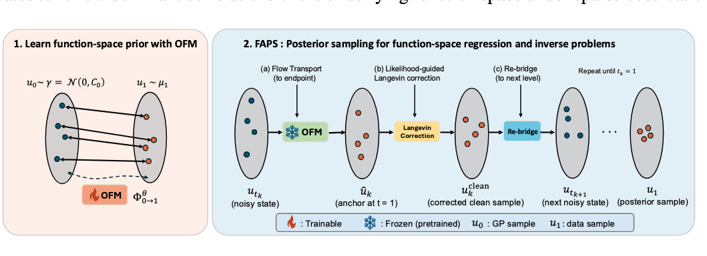
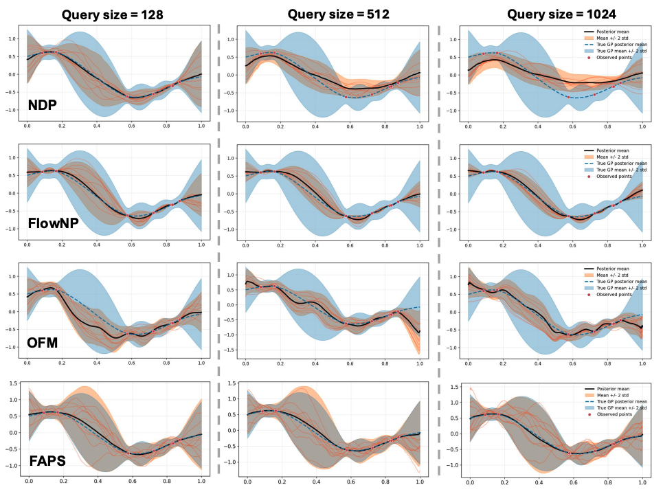
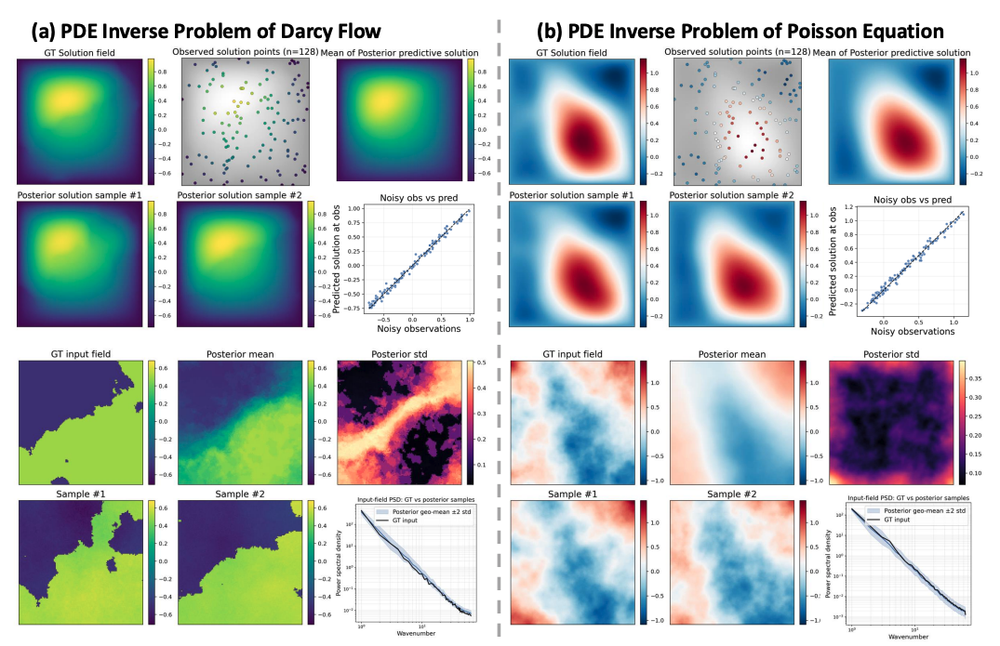

# Flow Annealing Posterior Sampling for Function-Space Regression and Inverse Problems
### [FAPS Paper](https://arxiv.org/abs/2606.22346)

By Yaozhong Shi, Zachary E. Ross and Yisong Yue

## Model Architecture 


## Stochastic-Process Regression 


## PDE Inverse 



## Setup

To set up the environment, create a conda environment

```bash
# clone project
git clone https://github.com/yzshi5/FAPS.git
cd FAPS

# create conda environment
conda env create -f environment.yml

# Activate the `faps` environment
conda activate faps
```

Some MINO/weather experiments also require the MINO model utilities included in this repo.

## Datasets and Checkpoints 

Checkpoints and small prepared datasets are stored on Hugging Face:

```text
https://huggingface.co/Yaozhong/FAPS
```
The scripts expect checkpoints and small prepared test datasets under the repository tree, for example:

```text
PDE_inverse/checkpoints/
PDE_inverse/datasets/
Regression/checkpoints/FAPS_prior/
```

Download the uploaded artifacts from Hugging Face:

```bash
python - <<'PY'
from huggingface_hub import snapshot_download

snapshot_download(
    repo_id="Yaozhong/FAPS",
    repo_type="model",
    local_dir=".",
    allow_patterns=[
        "PDE_inverse/checkpoints/**",
        "PDE_inverse/datasets/**",
        "Regression/checkpoints/FAPS_prior/GP_gibbs_epoch_500.pt",
        "Regression/checkpoints/FAPS_prior/GP_matern_epoch_500.pt",
    ],
)
PY
```

For the original PDE train/test data, you can also use:

```bash
cd PDE_inverse
python datasets/download_dataset.py all --output-dir datasets/PDE_inverse
```

The helper Python files for downloading and preprocessing the full PDE datasets are also available under:

```text
https://huggingface.co/Yaozhong/FAPS/tree/main/PDE_inverse/datasets
```

After downloading the Hugging Face Arrow shards, convert them to `.npy` files with:

```bash
python datasets/inital_process.py \
  --input-root datasets/PDE_inverse \
  --output-root datasets/PDE_inverse_npy
```

To download test files only:

```bash
python datasets/download_dataset.py all --test --output-dir datasets/PDE_inverse
```
## Quick Test 

To reproduce the results of GP regression, first download the checkpoint for the prior. Then run : 

```bash
cd Regression
bash scripts/eval_GP_matern_reg.sh
```

To reproduce the results of Darcy Flow PDE inverse, first download checkpoints for prior and PDE surrogate and small prepared test dataset. 
Then run 

```bash
cd PDE_inverse
bash scripts/eval_darcy_inverse.sh
```

## Run FAPS for Functional Regression 

To run FAPS for functional regression, we just need to train a prior. Let's take GP matern case as an example

```bash
cd Regression
```

Train priors:

```bash
bash scripts/train_GP_matern_prior.sh
```

Evaluate regression tasks:

```bash
bash scripts/eval_GP_matern_reg.sh
```


## Run FAPS for PDE Inverse 


All commands below are run from:

```bash
cd PDE_inverse
```
PDE inverse outputs are written under:

```text
PDE_inverse/outputs/
```

In the following steps, we take Darcy Flow PDE inverse problem as an example. The pipeline is the same for other PDE problem. 

#### 1. Train and evaluate FNO Forward Surrogates
The first step is to train the FNO forward surrogate, you can also replace FNO with other PDE surrogate, like Transolver, GAOT etc or just a differentiable PDE solver 

```bash
bash scripts_surrogate/train_darcy_FNO.sh
bash scripts_surrogate/eval_darcy_FNO.sh
```

#### 2. Train FAPS Priors
After we get the trained forward surrogate, we can train the Flow Matching priors for FAPS. In this study, we test both function-space prior (FNO prior) and standard finite-dimensional prior (UNet prior). The results show the backward compatibility of FAPS

```bash
bash scripts/train_darcy_prior.sh
bash scripts/train_darcy_prior_unet.sh
```
#### 3. Run Inverse Evaluation

Then run single-case evaluation with FNO or UNet prior 

```bash
bash scripts/eval_darcy_inverse.sh
bash scripts/eval_darcy_inverse_unet.sh
```

When use FNO prior, the entire formulation is built on function space, we can do zero-shot inference for PDE inverse problem. Darcy super-resolution inverse evaluation:

```bash
bash scripts/eval_darcy_inverse_sup.sh
```
#### 4. Reproduce the reported performance 

We need to run FAPS over entire test datasets, each test dataset in the paper contains 100 test cases. 

```bash
bash scripts_metrics/eval_darcy_inverse_all_test.sh
bash scripts_metrics/eval_darcy_inverse_all_test_unet.sh
```


## Comments 
- A paradigm shift from Neural Processes, a principled Bayesian framework for general stochastic process regression. 
- FAPS is a generic posterior sampling algorithm for both function-space and finite-dimensional (standard) flow matching prior. We recommend using U-Net based prior (by default) if the resolution is fixed.
- With dense observations, you can set rank=0 to inject white noise during Langevin steps. (UNet prior is recommended)
- When use differential PDE solver as the surrogate, which is sensitive to initialization, FAPS is much more stable than Diffusion-based posterior sampling method.

## Notes
- Check shell scripts before long runs; they set GPU devices, checkpoint names, and dataset paths.
- Checkpoints and datasets are intentionally ignored by Git and should be downloaded from Hugging Face.
- FAPS is robust to a very wide range of hyperparameters, the same configuration can be used for different setting 


## Reference 
If you find this repository useful for your research, please consider citing our work
```bibtex
@article{shi2026flow,
  title={Flow Annealing Posterior Sampling for Function-Space Regression and Inverse Problems},
  author={Shi, Yaozhong and Ross, Zachary E and Yue, Yisong},
  journal={arXiv preprint arXiv:2606.22346v1},
  year={2026}
}

